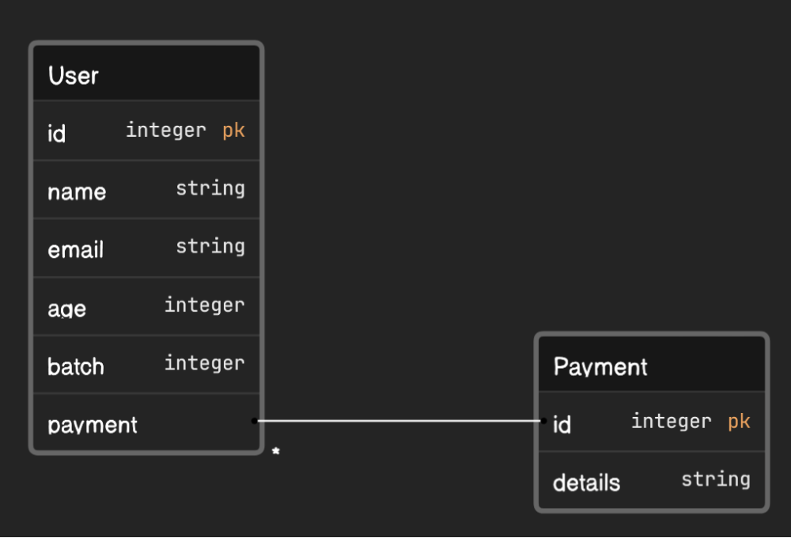
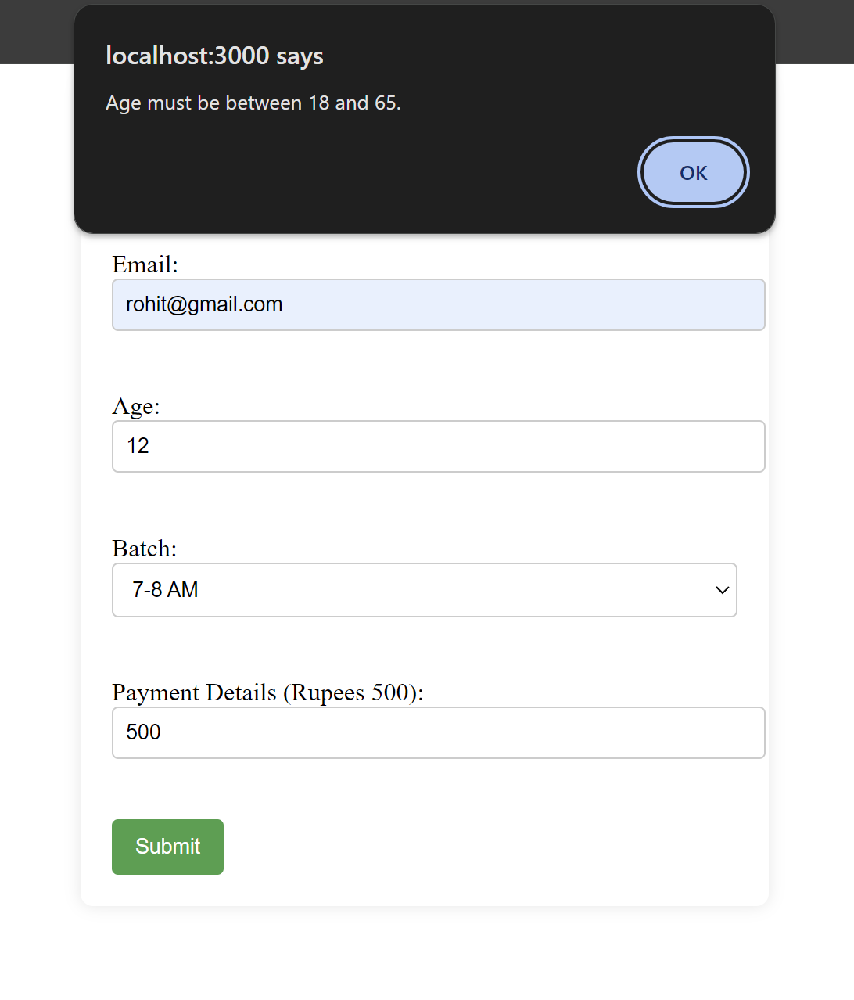
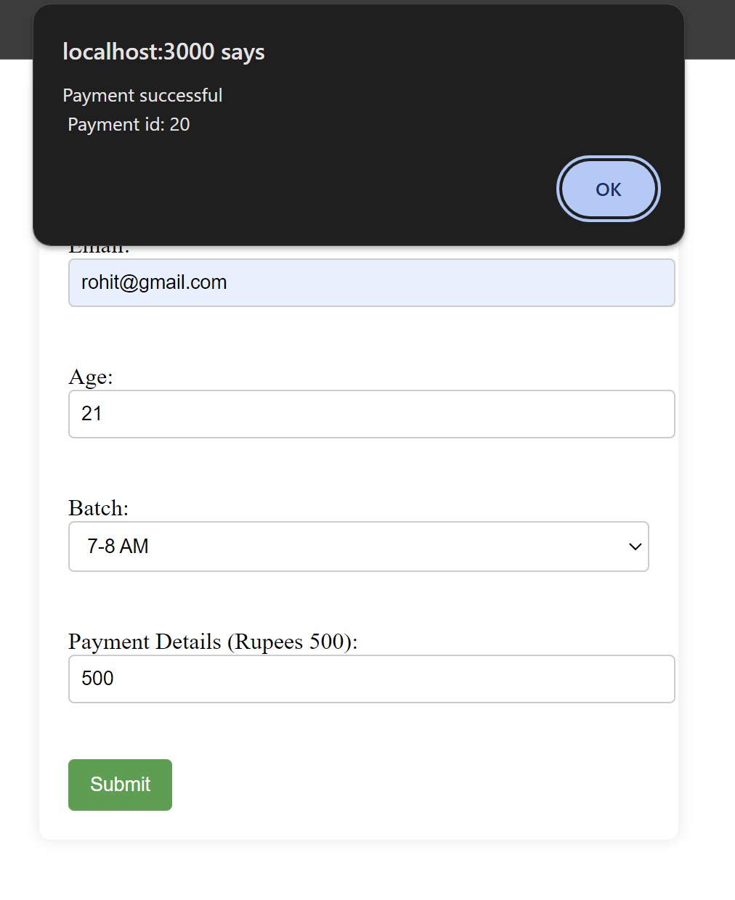

# FlexMoney

# Yoga Class Registration App

This is a simple web application built with React for the frontend and Django for the backend. It allows users to register for monthly yoga classes, choose their preferred batch, and make monthly payments.

## Features

- User-friendly registration form with basic validations.
- Monthly payment processing using a mock payment function.
- Batch selection with the option to change batches each month.

## Technologies Used

- Frontend: React
- Backend: Django
- Database: SQLite 

## Getting Started

### Prerequisites

- Node.js and npm installed for the React frontend.
- Python and pip installed for the Django backend.


## Django Models

The backend of this application uses Django models to store user registration data. Below are the main models used in this project.

### `User`

This model represents a user registered for the yoga classes.

- **Fields:**
  - `id` (Primary Key)
  - `name`: The name of the user.
  - `email`: The email of the user
  - `age`: The age of the user.
  - `batch`: The batch selected by the user.
  - `payment`: Payment done by the user

### `Payment`

This model represents a payment done by some user
- **Fields:**
  - `id` (Primary Key)
  - `details`: The payment details

## Database ER Diagram



## APIs

### POST /api/make-payment/

This API endpoint is used for submitting the yoga class registration form.

#### Request

- **Method:** POST
- **Endpoint:** `/api/make-payment`
- **Request Body:**

  ```json
  {
    "name": "Rohit Agrawal",
    "email": "rohit@gmail.com", 
    "age": 20,
    "selectedBatch": "7-8 AM",
    "paymentDetails": "xyz",
  }

## Outputs

### When age is entered incorrectly



### When all details are filled correctly

